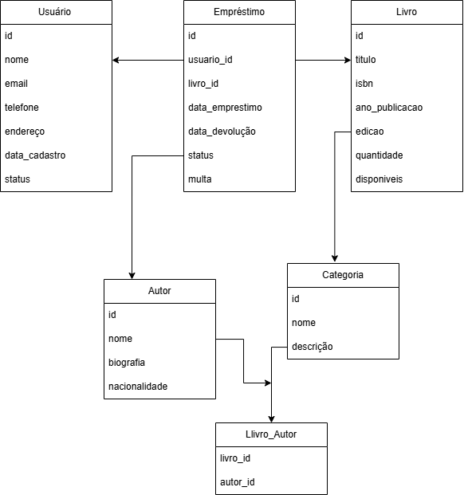

# Sistema de Gerenciamento de Biblioteca
## Definição do Problema
Atualmente, muitas bibliotecas ainda utilizam sistemas manuais ou planilhas para controlar seu acervo, empréstimos e usuários. Isso gera problemas como:
- Dificuldade no controle de livros disponíveis vs. emprestados
- Falta de histórico de empréstimos
- Controle manual de multas por atraso
- Dificuldade na busca e catalogação de livros
- Processos manuais para cadastro de usuários

## Solução Proposta
Desenvolver um sistema de gerenciamento de biblioteca que automatize os principais processos:
- **Cadastro e gerenciamento de livros** - controle completo do acervo
- **Cadastro de usuários** - controle de membros da biblioteca
- **Sistema de empréstimos** - registro e controle de empréstimos
- **Controle de devoluções** - registro de devoluções e cálculo de multas
- **Gestão de autores e categorias** - organização do catálogo

### Funcionalidades Principais
1. Cadastro de livros com informações detalhadas
2. Cadastro de usuários/membros
3. Realização de empréstimos
4. Registro de devoluções
5. Controle de multas por atraso
6. Consulta de disponibilidade de livros
7. Histórico de empréstimos por usuário
8. Gestão de categorias e autores

### Fluxo Geral
1. Usuário se cadastra no sistema
2. Livros são cadastrados com informações completas
3. Usuário solicita empréstimo de livro disponível
4. Sistema registra empréstimo com data de devolução
5. Ao devolver, sistema verifica atrasos e aplica multas se necessário
6. Livro fica disponível para novos empréstimos

## DER (Diagrama Entidade-Relacionamento)


### Descrição das Tabelas
#### 1. USUARIO
- Armazena informações dos usuários/membros da biblioteca
- Campos: id, nome, email, telefone, endereço, data_cadastro, status

#### 2. LIVRO
- Contém informações do acervo de livros
- Campos: id, título, ISBN, ano_publicacao, edicao, quantidade_total, quantidade_disponivel

#### 3. AUTOR
- Cadastro de autores dos livros
- Campos: id, nome, biografia, nacionalidade

#### 4. CATEGORIA
- Categorias para classificação dos livros
- Campos: id, nome, descricao

#### 5. EMPRESTIMO
- Registro de todos os empréstimos realizados
- Campos: id, usuario_id, livro_id, data_emprestimo, data_devolucao_prevista, data_devolucao_real, status, valor_multa

#### Tabela de Relacionamento: LIVRO_AUTOR
- Relacionamento muitos-para-muitos entre Livro e Autor
- Campos: livro_id, autor_id

#### Tabela de Relacionamento: LIVRO_CATEGORIA
- Relacionamento muitos-para-muitos entre Livro e Categoria
- Campos: livro_id, categoria_id

## Estrutura do Projeto Spring Boot
```
src/
├── main/
│   ├── java/
│   │   └── com/
│   │       └── biblioteca/
│   │           ├── entity/
│   │           ├── dto/
│   │           │   ├── request/
│   │           │   └── response/
│   │           ├── mapper/
│   │           ├── repository/
│   │           ├── service/
│   │           └── resource/
│   └── resources/
│       └── application.properties
```

### Endpoints Principais
- `GET /api/livros` - Listar livros
- `POST /api/livros` - Cadastrar livro
- `POST /api/usuarios` - Cadastrar usuário
- `POST /api/emprestimos` - Realizar empréstimo
- `PUT /api/emprestimos/{id}/devolucao` - Registrar devolução
- `GET /api/usuarios/{id}/emprestimos` - Histórico de empréstimos

---
### URLs para uso
- Swagger UI: http://localhost:8080/swagger-ui.html
- H2 Console: http://localhost:8080/h2-console
- API Base: http://localhost:8080/api-docs

### Para testar no H2 Console:
- JDBC URL: jdbc:h2:mem:testdb
- User Name: sa
- Password: (deixe em branco)